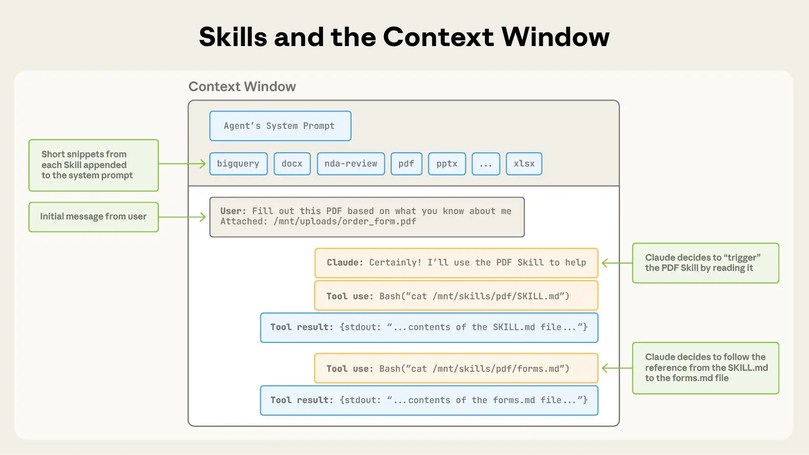

## Why Skills Exist: From Capable to Expert

<details>
<summary>Details</summary>

### The Core Problem

How do we give general-purpose agents domain-specific expertise without rebuilding a custom agent every time?

- **Capability ≠ expertise** — agents can run code and search, but don't know *your* conventions, tools, or workflow
- **No procedural knowledge** — they act generally, not specifically to your domain
- **Fragmentation** — teams build separate custom agents per use case; doesn't scale
- **No portability** — expertise stays siloed, can't be shared or reused across teams


---

### The Answer: Skills

Instead of hardcoding expertise into the agent itself, you package it into a **Skill** — a self-contained folder of instructions, scripts, and reference files. The agent loads it dynamically when it recognizes the task.

```
Agent (general-purpose)  +  Skill (domain expertise)  =  Specialist behavior
```

**Key properties of Skills:**
- **Modular** — packaged independently from the agent
- **Portable** — shareable across agents and teams
- **Composable** — multiple skills can be loaded together
- **Dynamic** — loaded on demand, not hardcoded

The agent stays general-purpose. The expertise travels alongside it as a modular attachment.

</details>

---

## The anatomy of a skill and progressive disclosure

<details>
<summary>Progressive Disclosure & Skill Levels</summary>

Before exploring what a skill contains, it helps to understand the principle behind how it delivers that content: **progressive disclosure**.

A skill can hold a lot — scripts, reference docs, forms, tools. Dumping everything into the agent at once creates noise and confusion. Instead, skills are designed to reveal information **from general to specific**, only as needed.

- **Start broad** — the agent sees just the skill's name and description at startup
- **Go deeper on demand** — full instructions, scripts, and assets are loaded only when the skill is invoked
- **Hierarchy over monolith** — rather than one large `skill.md`, content is structured in layers so the agent gets the right level of detail at the right time

This hierarchical design keeps the agent focused — and is the organizing principle behind how skills are structured.

| Level | What's loaded | When | Purpose |
|---|---|---|---|
| 1 | metadata `name` + `description` | Always, at startup | Routing — decide if skill is relevant |
| 2 | Full `SKILL.md` body | When skill is relevant | Instructions — how to use the skill |
| 3+ | Linked files (scripts, references, templates, sub-instructions) | Only when needed within a task | Depth — handle complexity and scenario-specific detail |

**What Lives at Level 3+**

| Type | Purpose | Key distinction |
|---|---|---|
| **Scripts** | Executable code Claude runs directly as tools | Meant to be *executed*, not read |
| **References / Examples** | Docs, scenario walkthroughs, usage examples | Read into context to guide reasoning; loaded only when the scenario matches |
| **Data / Templates** | Structured input files, output templates, schemas | e.g. a PDF form template or a CSV schema bundled with the skill |
| **Sub-instructions** | One file per distinct workflow within a skill | `SKILL.md` is the table of contents; each sub-file is a chapter opened on demand |

</details>

<details>
<summary>Skills and the context window</summary>



The sequence of operations shown:

1. To start, the context window has the core system prompt and the metadata for each of the installed skills, along with the user’s initial message;
2. Claude triggers the PDF skill by invoking a Bash tool to read the contents of pdf/SKILL.md;
3. Claude chooses to read the forms.md file bundled with the skill;
4. Finally, Claude proceeds with the user’s task now that it has loaded relevant instructions from the PDF skill.

</details>

---

## Developing and evaluating skills

<details>
<summary>1. Start simple, fill gaps as they appear</summary>

- Begin with a plain agent and no skills — just a base prompt, or agent with fixed workflow.
- Run it on real tasks and observe where it fails or struggles; Each gap you find is a candidate for a skill
- Build skills one at a time to address specific, observed failures
- Different tasks will reveal different gaps — let real usage drive what you build, not upfront assumptions

</details>

<details>
<summary>2. Organize for growth</summary>

- When SKILL.md gets too long, split content into separate linked files
- Keep mutually exclusive or rarely combined contexts in separate files — don't load what isn't needed
- For scripts, be explicit about intent: is this file meant to be executed by Claude, or read as reference?

</details>

<details>
<summary>3. Evaluate the process, not just the outcome</summary>

- Monitor the full transcript — every tool call, every file Claude loads, every decision it makes
- Watch for unexpected trajectories: did Claude load the wrong skill? Skip a step? Overuse certain context?
- Pay close attention to name and description — these are what Claude uses to decide whether to trigger a skill at all. If Claude triggers the wrong skill or misses the right one, the description is likely the problem

</details>


## Reference:
### Claude:
- [open standard Agent Skills](https://agentskills.io/home)
- [Equipping agents for the real world with Agent Skills](https://www.anthropic.com/engineering/equipping-agents-for-the-real-world-with-agent-skills)
- [The-Complete-Guide-to-Building-Skill-for-Claude](https://resources.anthropic.com/hubfs/The-Complete-Guide-to-Building-Skill-for-Claude.pdf)
- [Claude's skills system](https://github.com/anthropics/skills/tree/main/skills/docx)
    - [Improving skill-creator](https://github.com/anthropics/skills/tree/main/skills/skill-creator)
- [5 Agent Skill design patterns every ADK developer should know](https://x.com/GoogleCloudTech/status/2033953579824758855)

- [Lessons from Building Claude Code: Seeing like an Agent](https://x.com/trq212/article/2027463795355095314)
- [Testing Agent Skills Systematically with Evals](https://developers.openai.com/blog/eval-skills)
