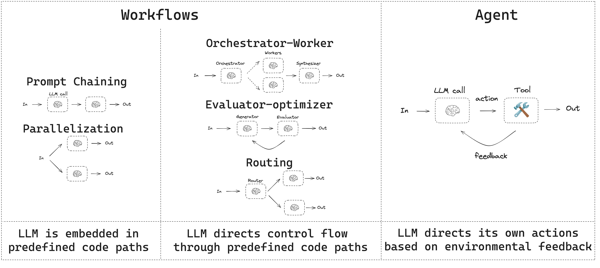

# Agents: Giving AI a Toolkit


## Single-agent systems


### Start simple, scale intelligently. (for workflow)

1. Start from prompt engineering
2. Expand to complicated agent workflow: 
    - Prompt chaining
    - Routing
    - Parallelization
3. Multi-agent
    - Orchestrator-workers
    - Evaluator-optimizer

    **Choose the right model for the job**, The key is balancing three factors: capabilities, speed, and cost.


**An agent goes beyond a static workflow.** Where a static workflow follows a predetermined path, an agent can (1) reason semantically about which action to take next, and (2) update that reasoning iteratively based on what it observes.

This reason → act → observe loop works as follows:
1. A user gives the agent a task.
2. The agent formulates a plan and selects actions from its available tools.
3. The agent observes the result and adjusts its approach accordingly.
4. This cycle repeats until the task is complete — or a stopping condition is reached, such as a human review checkpoint.


### Practice modular design (for tools and skills)

An agent is a **componentized architecture**, You can think agent as:
- Prompts are defined in centralized configuration files or libraries
- **Tools** — discrete callable functions for each capability (web search, database queries, email)


**Core components:**
- **AI model** — the reasoning engine; reads context, decides what to do next, and generates responses
- **Prompt** — defines the agent's role, capabilities, and behavioral boundaries
- **Tools** — integrations that let the agent act on external systems (APIs, databases, code executors)
- **Skills** — domain knowledge bundles that extend base capability with specialized workflows and best practices, enabling one agent to handle tasks that would otherwise require multiple specialists


for skills, This modular approach means you can update skills independently without
rewriting agent logic, share Skills across multiple Agents, and scale capabilities
as your organization's needs evolve.

https://docs.langchain.com/oss/python/langgraph/workflows-agents

## Reference

- https://www.anthropic.com/engineering/building-effective-agents
- https://resources.anthropic.com/hubfs/Building%20Effective%20AI%20Agents-%20Architecture%20Patterns%20and%20Implementation%20Frameworks.pdf?utm_source=enterpriseaiexecutive.ai&utm_medium=referral&utm_campaign=deloitte-s-ai-playbook-for-cxos
- https://www.anthropic.com/engineering/equipping-agents-for-the-real-world-with-agent-skills


- [Demystifying evals for AI agents](https://www.anthropic.com/engineering/demystifying-evals-for-ai-agents)


Knowing things is not enough. A model that can only read and write text cannot browse a website, execute code, query a database, or send an email. The agent paradigm closes this gap — not by making the model smarter, but by giving it **structure, actions, and domain knowledge**.

An agent has three layers:

---


<details>
<summary>
<b>Workflow — the structure of how the agent thinks and acts</b>
</summary>

Workflow is the skeleton: it defines how information flows, when decisions are made, and what runs in sequence versus in parallel. Without a workflow, you have a prompt. With a workflow, you have a system.

Common patterns:

- **Prompt chaining** — break a complex task into sequential steps, each feeding the next
- **Routing** — classify the input and direct it to the right specialist
- **Parallelization** — run independent subtasks concurrently, then merge
- **Orchestrator-worker** — a coordinating agent delegates to specialized sub-agents
- **Evaluator-optimizer** — one agent critiques and refines another's output

The workflow doesn't care what tools exist. It defines *when* and *how* the agent decides to act.

</details>

---

<details>
<summary>
<b>Tools — the actions the agent can take</b>
</summary>

A model without tools is a chatbot. Tools are what make an agent *act*, not just *speak*. A tool is any discrete, callable function — a web search, a database query, a code executor, an API call, or even another LLM call acting as a classifier or critic.

The agent reads the available tools, reasons about which one fits the current step, and invokes it. The result feeds back into the next reasoning step. This loop — *reason → act → observe → reason* — is the core of agentic behavior.

Without tools, there is no agent.

</details>

---

<details>
<summary>
<b>Skills — domain knowledge bundled with the tools that serve it</b>
</summary>

As the number of tools grows, raw lists become unmanageable. Skills solve this by grouping instructions and relevant tools around a single domain: a PDF skill knows how to read, fill, and validate PDF forms; an email skill knows how to draft, send, and parse replies; a debugging skill knows how to read stack traces and propose fixes.

A skill is not just a group of tools — it is **domain knowledge + the tools and scripts that operationalize it**. The agent reads a skill's instructions first, then uses the tools inside it guided by that context. This keeps the agent focused and the tool surface comprehensible.

</details>

```
Workflow  →  defines the structure and flow
Tools     →  define what the agent can do (callable actions)
Skills    →  define how to behave in a domain (instructions + relevant tools)
```

→ [Agent](Agent/readme.md) · [Building Effective Agents](Agent/Building%20effective%20agents/Readme.md) · [Agent Skills](Agent/Skills/)
