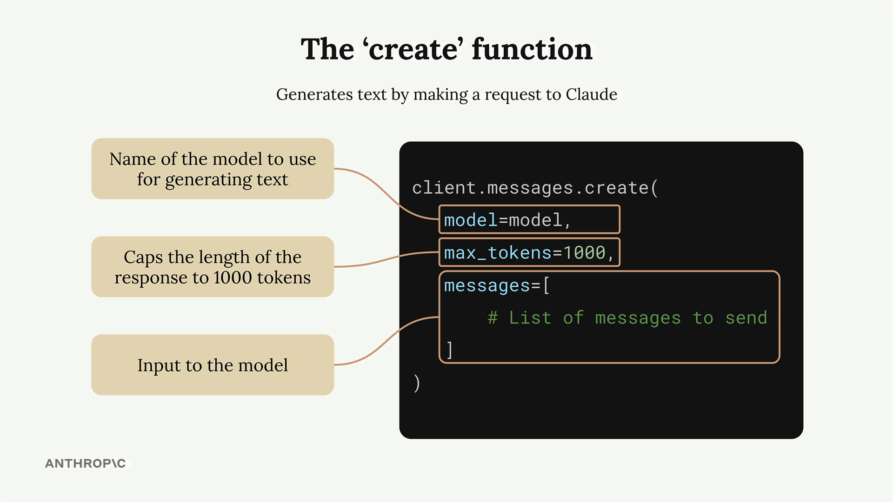

# Messages API

## 1. Creating a Message

<details>
<summary>Click to expand</summary>



The core request requires three parameters:

| Parameter | Description |
|:---|:---|
| `model` | The Claude model to use |
| `max_tokens` | Upper limit on response length — a safety cap, not a target |
| `messages` | The conversation history sent to Claude |

</details>

---

## 2. Multi-Turn Conversations

<details>
<summary>Click to expand</summary>


A conversation is a list of message objects passed back and forth. Each turn, one party appends a new dictionary to the list.

| Role | Description |
|:---|:---|
| `user` | Content sent by the human |
| `assistant` | Responses generated by Claude |

```python
messages = [
    {"role": "user",      "content": "Generate a JSON rule"},
    {"role": "assistant", "content": "```json\n{ ... }\n```"},
    {"role": "user",      "content": "Make it shorter"},
]
```

> **Note — Memory:** Claude has no persistent memory across API calls. The full conversation history must be passed with every request to maintain context.

### Raw API
```python
def add_user_message(messages, text):
    user_message = {"role": "user", "content": text}
    messages.append(user_message)

def add_assistant_message(messages, text):
    assistant_message = {"role": "assistant", "content": text}
    messages.append(assistant_message)

def chat(messages):
    message = client.messages.create(
        model=model,
        max_tokens=1000,
        messages=messages,
    )
    return message.content[0].text

# Start with an empty message list
messages = []

# Add the initial user question
add_user_message(messages, "Define quantum computing in one sentence")

# Get Claude's response
answer = chat(messages)

# Add Claude's response to the conversation history
add_assistant_message(messages, answer)

# Add a follow-up question
add_user_message(messages, "Write another sentence")

# Get the follow-up response with full context
final_answer = chat(messages)

```


</details>

---

## 3. System Prompts

<details>
<summary>Click to expand</summary>


System prompts set Claude's behavior, persona, or constraints before the conversation begins. They are separate from the `messages` array and apply globally to the entire session.

</details>

---

## 4. Structured Responses (JSON)

<details>
<summary>Click to expand</summary>

By default, Claude wraps JSON output in markdown fencing and may include explanatory text:

```json
{
  "source": ["aws.ec2"],
  "detail-type": ["EC2 Instance State-change Notification"],
  "detail": {
    "state": ["running"]
  }
}
```

The JSON is valid, but the markdown formatting and surrounding text make it difficult to parse programmatically.

### Approaches for Raw JSON Output

| Method | Mechanism | Reliability | Effort |
|:---|:---|:---:|:---:|
| Prompt only | Instruct Claude to return raw JSON with no backticks | Medium — usually works, occasionally adds text | Lowest |
| Prefill + stop sequence | Prefill ` ```json `, stop at ` ``` `(Backtick) | High | Low |
| Post-process with regex | Let Claude respond freely; extract `{...}` via regex | Medium — brittle on edge cases | Low |
| Tool schema | Define a tool whose input schema is your JSON shape | Highest — structurally enforced, invalid JSON impossible | High |

</details>
