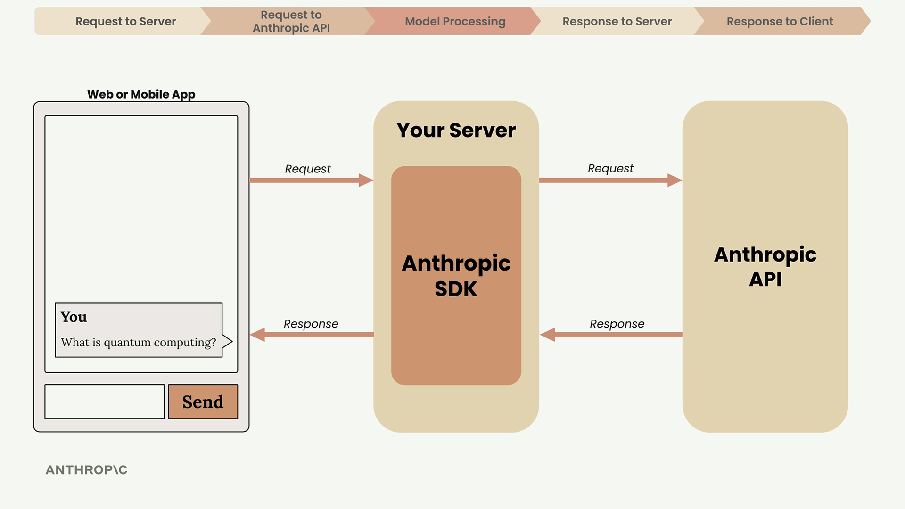

## Claude Models

Anthropic offers three Claude model tiers, each balancing intelligence, cost, and speed differently.

| | **Claude Opus** | **Claude Sonnet** | **Claude Haiku** |
|:---|:---:|:---:|:---:|
| **Intelligence** | Highest | High | Moderate |
| **Speed** | Slower | Balanced | Fastest |
| **Cost** | Most expensive | Balanced | Most affordable |
| **Best for** | Complex, demanding tasks | General-purpose use | Fast, lightweight tasks |
| | ← More intelligent | | More efficient → |

