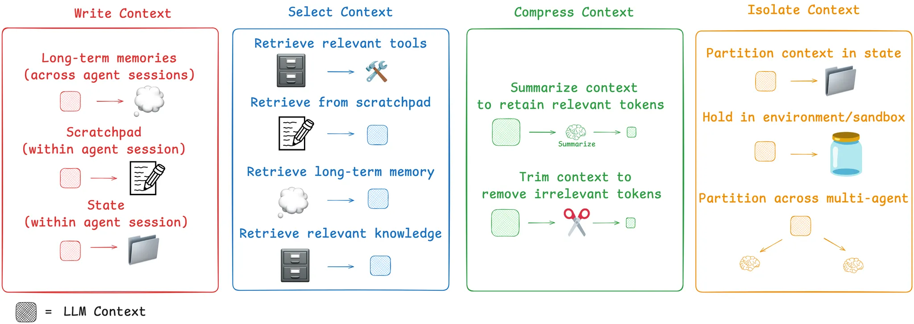

# Context Engineering for Agents

https://www.langchain.com/blog/context-engineering-for-agents


**The cores of Context Engineering,  how LangGraph is designed to support them!**



## write:


### short-term: Scratchpads
- [The "think" tool: Enabling Claude to stop and think in complex tool use situations](https://www.anthropic.com/engineering/claude-think-tool)
- [How we built our multi-agent research system](https://www.anthropic.com/engineering/multi-agent-research-system)


**Core Mechanism: Separation of Storage and Usage**
> Information is fully stored outside the context window (application memory) and selectively loaded at each invocation to combat "context rot."

---

<details>
<summary><strong>Mode 1: Explicit Tool Calls — Agent actively calls <code>write_to_scratchpad</code> tool to record.</strong></summary>

| Step | Action |
|---|---|
| 1 | Agent thinks: "My plan: 1. Check stock price; 2. Check news. Executing step one." |
| 2 | Agent calls `write_to_scratchpad`, writes the plan to scratchpad. |
| 3 | Agent thinks: "Stock price retrieved: $950. Executing step two." |
| 4 | Agent calls `write_to_scratchpad` again, writes the observation to scratchpad. |
| **Pros** | Transparent behavior, strong debuggability. |
| **Cons** | High model capability required, increases token overhead. |


<details>
<summary><strong>Example 1. Tool Call — Write to a File</strong></summary>

The agent has a `write_note` tool it can call at any point to save things it shouldn't forget.

```python
import json, os

# Tool the agent can call
def write_note(key: str, value: str):
    notes_path = "/tmp/agent_scratchpad.json"
    notes = json.load(open(notes_path)) if os.path.exists(notes_path) else {}
    notes[key] = value
    json.dump(notes, open(notes_path, "w"))

def read_notes() -> dict:
    try:
        return json.load(open("/tmp/agent_scratchpad.json"))
    except FileNotFoundError:
        return {}
```

**When the agent uses it:**

1. Agent reads 10 search results  
   → calls `write_note("key_findings", "X causes Y, paper from 2023")`
2. Agent digs into sub-topic (context fills up)  
   → calls `write_note("plan_remaining", "still need to check Z angle")`
3. Agent nears context limit  
   → calls `read_notes()` → retrieves its plan and findings without relying on scroll-back

> This is exactly what Anthropic's LeadResearcher does — it saves its plan to memory at the start to persist context, since if the context window exceeds 200,000 tokens it will be truncated. langchain

</details>


<details>
<summary><strong>Example 2. LangGraph State Field (Most Common Pattern)</strong></summary>

A dedicated scratchpad field in the agent's state object — separate from messages.

```python
from langgraph.graph import StateGraph
from typing import TypedDict, Annotated
from operator import add

class AgentState(TypedDict):
    messages: list          # what the LLM sees
    scratchpad: dict        # hidden working notes — NOT sent to LLM every turn
    final_answer: str

# Node: agent writes a note mid-task
def research_node(state: AgentState):
    # ... LLM does work ...
    return {
        "scratchpad": {
            **state["scratchpad"],
            "sources_checked": ["arxiv:2301.xxx", "docs.python.org"],
            "hypothesis": "The bug is in the async handler"
        }
    }

# Node: agent reads its own notes before concluding
def conclusion_node(state: AgentState):
    notes = state["scratchpad"]
    # Inject only the relevant notes into the prompt — not the full message history
    prompt = f"Based on your earlier notes: {notes}, write a final answer."
    # ... call LLM with just this prompt ...
```

> **Key insight:** The state schema can have fields that context can be written to, where one field (e.g., `messages`) is exposed to the LLM at each turn, but the schema isolates information in other fields for more selective use. langchain

</details>

</details>

---

<details>
<summary><strong>Mode 2: Implicit Format-Driven — Framework automatically captures <code>Thought:</code> and similar structured output.</strong></summary>

| Step | Action |
|---|---|
| 1. Agent output | **Thought**: "Task needs 3 steps, first check stock price..." <br> **Action**: call `get_stock_price` tool. |
| 2. Framework processing | Automatically extracts "Thought" content → stores in scratchpad. <br> Automatically executes "Action" content. |
| **Pros** | Efficient, automated, better aligned with thought flow. |
| **Cons** | Depends on framework implementation, relatively black-box. |


<details>
<summary><strong>Example 3. Claude's think Tool (Extended Thinking as Scratchpad)</strong></summary>

Scratchpads can be a tool call that simply writes to a file. langchain Anthropic's `think` tool is a clean example — the model writes internal reasoning that doesn't get fed back into the context window as a user/assistant message:

```python
tools = [
    {
        "name": "think",
        "description": "Use this to reason step by step before acting. Notes are saved but not shown to user.",
        "input_schema": {
            "type": "object",
            "properties": {
                "thought": {"type": "string"}
            }
        }
    },
    {
        "name": "search",
        "description": "Search the web",
        ...
    }
]

# Agent trajectory:
# Turn 1: tool_use → think("I need to check X before Y, and remember to verify Z")
# Turn 2: tool_use → search("X")
# Turn 3: tool_use → think("X confirmed, updating plan: skip Y, go straight to Z")
# Turn 4: tool_use → search("Z")
# Turn 5: text → Final answer
```

> The `think` calls act as a scratchpad — the model leaves itself notes between actions without bloating the messages list.

</details>

</details>