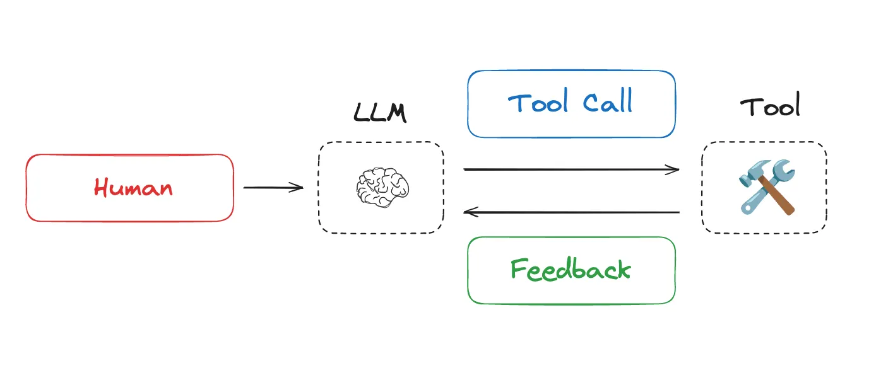

https://www.langchain.com/blog/context-engineering-for-agents

Context engineering is the art and science of filling the context window with just the right information at each step of an agent’s trajectory. In this post, we break down some common strategies — write, select, compress, and isolate — for context engineering by reviewing various popular agents and papers. 

## Context Engineering

### analogy to understand context engineering

As Andrej Karpathy puts it, LLMs are like a new kind of operating system:

| Component | Analogy | Role |
|---|---|---|
| **LLM** | CPU | The reasoning core — processes instructions and computes outputs, but holds no state of its own |
| **Context window** | RAM | The working memory — fast and immediately accessible, but limited in capacity |
| **Context engineering** | OS | The memory manager — curates what fits into RAM, scheduling the right information at the right time |

### Types of Context

What are the types of context that we need to manage when building LLM applications? Context engineering as an umbrella that applies across a few different context types:

- Instructions – prompts, memories, few‑shot examples, tool descriptions, etc
- Knowledge – facts, memories, etc
- Tools – feedback from tool calls

### Context Engineering for Agents

### The cores of Context Engineering

## How Long Contexts Fail (Four Common failures)

### Diagnostic model: Context Rot and the four failure types

These two concepts are related but distinct — one is the root cause, the other is the set of symptoms.

| | Definition |
|---|---|
| **Root cause — Context Rot** | A fundamental state of systematic decline in the model's cognitive abilities (memory, reasoning), caused by excessively long context hitting architectural bottlenecks |
| **Symptoms — Four failure types** | Diagnosable failure modes that manifest in specific tasks under the "rot" state: Poisoning, Distraction, Confusion, Conflict |

Context rot directly triggers, breeds, and amplifies these four failure modes.

**Core analogy**

> "A fatigued (**context rot**) driver (**LLM**), driving on a bad road (**four failure types**), dramatically increases the probability of a car accident (**task failure**)."

| Analogy | Maps to |
|---|---|
| Driver | LLM |
| Fatigue | Context Rot |
| Bad road | Four failure types |
| Car accident | Task failure |

---

this is about if context is not well-defined, what is the possible issues

https://www.dbreunig.com/2025/06/22/how-contexts-fail-and-how-to-fix-them.html?ref=blog.langchain.com#context-poisoning

1. Context Poisoning

2. Context Distraction

3. Context Confusion

4. Context Clash

