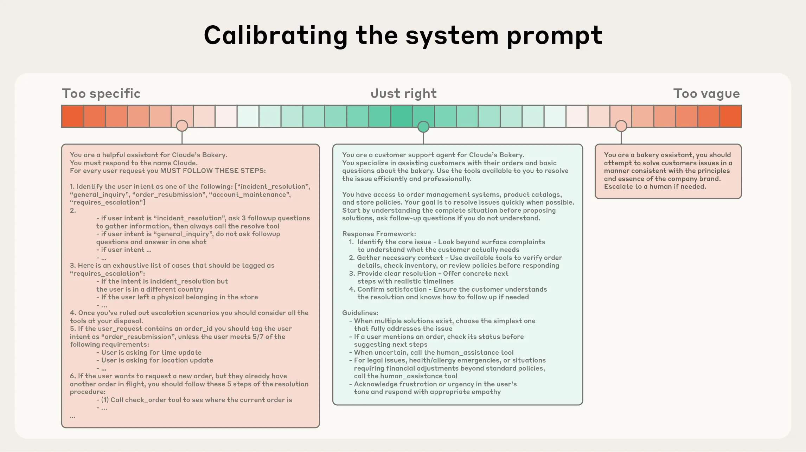

https://www.anthropic.com/engineering/effective-context-engineering-for-ai-agents


## 1. What is prompt engineering?

Prompt engineering is the craft of finding the right words — the "magic instructions" — to steer an AI model toward a desired output.

<details>
<summary><strong>Characteristics</strong></summary>

It is **static and one-shot**: you define the prompt before anything starts, and it never changes. This works well for simple, isolated tasks — "summarize this paragraph" or "write an email" — because the job is contained and done in a single exchange.

But as soon as the task becomes dynamic — spanning multiple steps, using tools, accumulating history — a fixed prompt is no longer enough.

</details>

## 2. Why is context engineering the evolution of prompt engineering?

<details>
<summary><strong>The evolution of generative AI: two phases</strong></summary>

**Phase 1 — One-off tasks**
- Single prompt in, single response out
- Tasks are self-contained: "write an email," "summarize this text," "translate this paragraph"
- A well-crafted prompt was all you needed

**Phase 2 — Agent age**
- An agent runs a model in a loop, autonomously, over an extended period of time
- At each iteration, the agent:
  1. Selects and invokes tools (web search, code execution, file access)
  2. Observes the results and decides the next action
  3. Evaluates its own progress and adjusts course

</details>

<details>
<summary><strong>New challenges the agent age brings</strong></summary>

- Every iteration generates new data — tool calls, outputs, reasoning traces, intermediate results
- This history accumulates fast; after dozens of steps, the agent carries a massive, growing record
- The critical question becomes: **what goes into the model’s context at each step — and what gets left out?**

</details>

<details>
<summary><strong>Why prompt engineering falls short, and why context engineering is needed</strong></summary>

- Prompt engineering was designed for a static world: write the instructions once, before the task begins
- It has no answer for a context that evolves dynamically with every step

Context engineering is its evolution:

| | Prompt Engineering | Context Engineering |
|---|---|---|
| Core question | *What should I tell the model?* | *What should the model see — and when?* |
| Scope | System prompt, written once | All tokens across the agent’s lifetime |
| Covers | Instructions | Instructions + tools + retrieved data + message history |
| Goal | Good first response | Useful, focused context at every inference step |

</details>

<details>
<summary><strong>The cockpit analogy</strong></summary>

- **Prompt Engineering** = the instruction manual handed to the pilot before takeoff
- **Context Engineering** = the cockpit dashboard during the flight

The dashboard must show exactly the right information at the right moment. Show too little and the pilot crashes. Show everything — every reading from every flight in aviation history — and the pilot crashes too.


</details>

## 3. If the context window is large enough, why not just feed everything in?

Since agents dynamically generate new steps, notes, and tool outputs — why not simply collect it all and feed it in? Modern models support up to 128k tokens. Shouldn’t that be enough?

The answer is no. More tokens does not mean better reasoning.

<details>
<summary><strong>Context Rot</strong></summary>

Research uses a "needle-in-a-haystack" test: hide one small fact inside a massive document, then ask the model to find it. The finding is consistent — as the context grows larger, the model’s ability to accurately recall information degrades. This is called **context rot**: the more you feed in, the fuzzier the model’s effective memory becomes.

</details>

<details>
<summary><strong>Three reasons why context rot happens</strong></summary>

<details>
<summary><strong>1. The n² attention problem</strong></summary>

- Transformer models work by having every token attend to every other token
- For n tokens, this creates n² pairwise relationships
- Double the context → the work quadruples
- This spreads the model’s representational capacity thin, making it harder to hold everything in focus

</details>

<details>
<summary><strong>2. Training distribution mismatch</strong></summary>

- Models are trained predominantly on shorter texts — articles, code snippets, documentation
- They have far less experience reasoning over very long sequences
- Techniques like position encoding interpolation can extend context length, but they are approximations — like correcting nearsightedness with a slightly-wrong prescription: you can see, but not perfectly

</details>

<details>
<summary><strong>3. The attention budget</strong></summary>

- Think of the model’s attention as a finite battery
- Every token added to the context drains a share of it
- Fill the context with irrelevant data — raw logs, redundant outputs — and the model has little budget left for the reasoning and instruction-following that actually matters

</details>

</details>


## 4.1. Static design: three pillars for effective context


<details>
<summary><strong>1. System Prompts — Find the Goldilocks Zone</strong></summary>

A system prompt need to find the right altitude among two opposite directions:

| | Approach | Problem |
|---|---|---|
| Too rigid | Write rule-based logic (IF this, THEN that) | Breaks the moment reality doesn't match the rules |
| Too vague | High-level guidance with no specifics | The model guesses what you want |
| **Sweet spot** | Clear guardrails + room for judgment | Handles expected cases and surprises |



**Structure tip:** Use XML tags (`<instructions>`, `<background>`) or Markdown headers to organize the prompt. This helps the model instantly locate what matters — where instructions end and data begins.

**Start minimal, expand from failure:** Begin with the leanest prompt that fully describes the expected behavior, test it on the best available model, then add instructions and examples only where failure modes reveal gaps. Minimal doesn't mean short — it means nothing unnecessary.

</details>


<details>
<summary><strong>2. Tools — Design well, select minimally</strong></summary>

Tools define the contract between an agent and its information/action space. Getting them right matters on two levels:

**Design each tool for efficiency**
- Return only what is needed — token-efficient output reduces context noise
- Make each tool self-contained and robust to error
- Write descriptions that are unambiguous about intended use
- Use descriptive input parameters that play to the model’s strengths
- Minimize functional overlap between tools

**Curate a minimal viable set**
- A bloated tool set creates ambiguous decision points
- The diagnostic test: if a human engineer can’t immediately say which tool to use in a given situation, the agent won’t be able to either
- A smaller, well-defined tool set also makes context pruning easier during long interactions

</details>

<details>
<summary><strong>3. Examples — Quality over quantity</strong></summary>

Instead of writing exhaustive rules for every edge case, provide a small set of **canonical examples** — gold-standard input/output pairs that demonstrate exactly what good behavior looks like. A few well-chosen examples teach the model the pattern far more effectively than pages of written rules.

**What a canonical example looks like**

Say you are building a bug-triage agent. Instead of writing rules like:
> "Don't assign severity 1 unless the system is down. Don't assign severity 3 if users are affected. Always include a root cause hypothesis..."

You show this:

```
User report: "Checkout button does nothing when clicked. Happening for all users since 2pm."

Agent response:
- Severity: 1 (all users blocked from completing purchases)
- Likely cause: recent deploy at 1:47pm may have broken the payment event handler
- Immediate action: roll back last deployment, monitor error logs
- Assigned to: payments team
```

The model reads this example and infers the reasoning pattern — what signals map to what severity, what a good response structure looks like — without needing it spelled out as rules.

</details>


## 4.2. Dynamic design: retrieving context at runtime

Since agents are LLMs autonomously using tools in a loop, how they collect, filter, and update context at each step is critical. There are two approaches — and the best systems combine both.

| | Pre-Inference (RAG) | Just-in-Time (Agentic) |
|---|---|---|
| Data volume | Limited by context window | Can reference terabytes |
| Precision | Risk of context rot | Only loads what is needed |
| Speed | Fast (one-shot) | Slower (multi-turn) |
| Agent role | Passive processor | Active explorer |

### Pre-inference retrieval (the traditional way)

<details>
<summary>content</summary>

- Before inference begins, a search system retrieves the top relevant documents and loads them into the prompt
- The agent then reasons over this pre-loaded context
- **Problem:** the agent is force-fed information before it understands the problem — like handing a student 10 textbooks before they’ve seen the exam question
- Data volume is limited by the context window, and there is a high risk of context rot from irrelevant content

</details>

### Just-in-time retrieval (the agentic way)

<details>
<summary>content</summary>

- Instead of pre-loading data, the agent holds lightweight references — file paths, stored queries, web links
- At runtime, it uses tools to fetch only what it needs, when it needs it
- **Example:** Claude Code never loads an entire codebase. It writes targeted queries and uses `head` / `tail` to read only the lines it needs
- **Human analogy:** you don’t memorize the internet — you keep bookmarks and know how to search when you need something

Two key mechanisms that make JIT retrieval effective:

<details>
<summary><strong>Metadata as signal</strong></summary>

- File names, folder hierarchies, and timestamps carry meaning without reading content
- A file named `test_utils.py` in a `/tests` folder implies a different purpose than the same name in `/src/core_logic/`
- The agent uses these signals to decide what is worth reading — preserving its attention budget

</details>

<details>
<summary><strong>Progressive disclosure</strong></summary>

Agents discover context incrementally, layer by layer:
1. Look at folder structure and file names
2. Check file sizes to gauge complexity
3. Read a summary or the first few lines
4. Go deep only when confident it’s the right place

This keeps only what’s necessary in working memory rather than loading everything upfront.

</details>

</details>

### The hybrid strategy

<details>
<summary>content</summary>

Pure just-in-time exploration is slow, and without proper guidance an agent can waste context chasing dead-ends or misusing tools. The most effective approach combines both:

- **Load upfront:** drop high-value, stable context immediately (e.g. `CLAUDE.md`, project README) for speed
- **Explore on demand:** use scouting tools (`glob`, `grep`) to navigate and retrieve everything else just-in-time

Claude Code uses exactly this model. As model capabilities improve, agents will require less human curation — but for now, **do the simplest thing that works** remains the best advice.

</details>

## 6. Context engineering for long-horizon tasks

Three strategies for managing context across tasks that run for hours or days.

<details>
<summary><strong>1. Compaction — The "Fresh Notebook" Strategy</strong></summary>

When context rot sets in and recall starts degrading, don’t push through — reset deliberately.

- **What it does:** the model reviews its own history, distills the high-signal content (architectural decisions, unresolved bugs), and discards the noise (raw logs, already-fixed code, filler messages)
- **Goal:** continuity without the baggage — the new conversation starts informed, not overloaded
- **Trade-off:** aggressive summarization risks discarding a small detail that turns out to matter three hours later

</details>

<details>
<summary><strong>2. Structured Note-taking — The "Detective’s Notepad"</strong></summary>

Instead of relying on context memory, the agent maintains an external file (e.g. `NOTES.md`) and writes key facts down as it works.

- **How it works:** the agent acts like a human researcher — when it discovers something important ("this library is version 2.0"), it writes it down rather than trusting recall
- **Pokémon example:** an AI playing Pokémon couldn’t hold 1,000 steps of gameplay in its context window, so it maintained an external map and to-do list; after each reset, it read its own notes to resume where it left off
- **Advantage over compaction:** more precise — captures specific values (e.g. "Pikachu is level 8") that a summary would round away

</details>

<details>
<summary><strong>3. Sub-agent Architectures — The "CEO" Strategy</strong></summary>

Don’t make one agent do everything. Use a hierarchy that isolates complexity.

- **The Manager (lead agent):** maintains a clean context window focused on the big-picture plan
- **The Specialist (sub-agent):** takes a specific task ("search the database for bug X"), does the messy work, and lets its own context get cluttered
- **The handoff:** once finished, the specialist returns a concise summary to the Manager and is discarded
- **Benefit:** the Manager’s context never gets polluted by the low-level detail the Specialist had to wade through

</details>