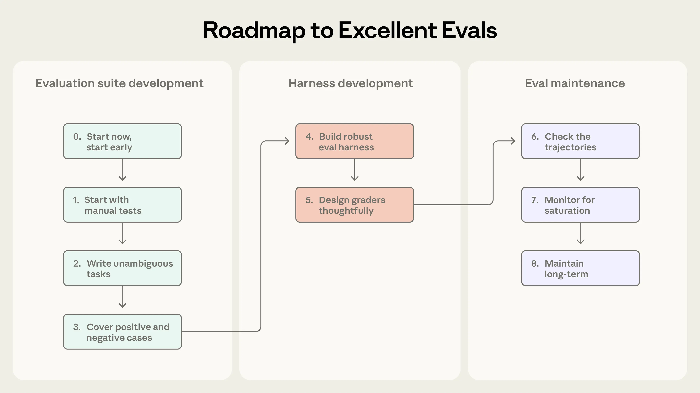

# Evaluation

- [Demystifying evals for AI agents](https://www.anthropic.com/engineering/demystifying-evals-for-ai-agents)

> ["If there is one thing we can teach people, it's that writing evals is probably the most important thing."](https://newsletter.eng-leadership.com/p/ai-evals-how-to-systematically-improve)

---

## 1. Why Evaluation Matters

<b>Why it matters</b>

- **Evaluation is the only convincing evidence** — A demo or a handful of good examples is anecdotal. Evaluation gives you statistical evidence: how reliable the system is, across what range of inputs, under what conditions. Without it, you can't make a credible claim about your product.

- **Evaluation tells you where to look** — A bad overall score is useless without segmentation. When you know which task types, which tools, or which reasoning steps are failing, you have a direction. Without that, improvement is guesswork.

<b>Why AI agents are harder to evaluate than traditional software</b>

The fundamental difference is **determinism**.

| | Traditional Software | AI Agent |
|---|---|---|
| **System** | Deterministic | Non-deterministic |
| **Path** | Fixed — same steps every run | Variable — tools, order, and reasoning differ each run |
| **Outcome** | Guaranteed — same input always yields same output | Probabilistic — correct answer not guaranteed even on a good path |

---

## 2. Components of AI Evaluation

<b>Components overview</b>

| Group | Component | Description | Suggestions |
|---|---|---|---|
| **Static Definition** | **Task** | One concrete test case: input + success criteria. Analogous to (x, y) in an ML test dataset. |  1. unambiguous tasks; 2. reference answer means the question is solvable; positive/negative |
| *(what you prepare)* | **Grader** | The scoring logic applied to an outcome. Analogous to ML metrics (MSE, cross-entropy). Can be rule-based, model-based, or human. | |
| | **Tag / Segment** | Category label on each task — e.g., recommendation, metric explanation, diagnosis. Lets you identify which segments underperform and apply different standards per segment. | |
| **Dynamic Execution** | **Outcome** | The final state produced by the agent — the only mandatory evaluation target. Analogous to y_predicted in ML. | |
| *(what happens at runtime)* | **Transcript** | The complete record of a trial: final output, tool calls, retrieved chunks, reasoning steps, intermediate results. Unlike ML which only cares about the final prediction, AI evaluation needs the path for diagnosis. | (1).Reading transcripts is the only way to verify that your evaluation logic is fair and accurately measuring what matters. (2). By analyzing these traces, you can distinguish between genuine agent mistakes and flawed grading that rejects valid solutions.|
| | **Trial** | One full run of a task. Because agents are non-deterministic, run ×10 trials and aggregate scores to get a stable signal. | |
| **System Infrastructure** | **Eval Harness** | stable environment, | Each trial should be “isolated” by starting from a clean environment.|
| *(what orchestrates it)* | **Agent Harness** | The agent's runtime scaffold — wraps the LLM with tools, memory, and environment so it can execute tasks. | |

<b>Going from zero to one: a roadmap to great evals for agents</b>

### Types of Graders for Agents

<b>Code-Based Grader</b>

| Method | Description |
|---|---|
| String Matching | Exact match on specific tokens, regex for format validation, fuzzy match for similarity |
| Outcome Verification | Query the database or file system to verify facts directly. Binary variants: Fail-to-Pass (fix confirmed) and Pass-to-Pass (regression confirmed) |

<b>Model-Based Grader (LLM-as-Judge)</b>

| Method | Description |
|---|---|
| Assertion | Best practice — decompose complex scoring into N True/False assertions. More stable and debuggable |
| Reference Alignment | Provide a gold-standard answer. Check semantic consistency while allowing paraphrase (not literal match) |
| Rubric Scoring | Avoid vague "score out of 10" prompts. Define judgment boundaries and levels in natural language |
| Pairwise Comparison | Don't score — just compare which of A vs. B is better. Ideal for regression and preference testing |
| Consensus | Three models vote or average. Reduces bias and hallucination from any single model |

- when use "Assertion" or "Rubric Scoring", consider partial credit.
- calibrate Model-Based Grader with Human Grader
- review grader process to find grading bugs.
    - For example, Opus 4.5 initially scored 42% on CORE-Bench, until an Anthropic researcher found multiple issues: rigid grading that penalized “96.12” when expecting “96.124991…”,

<b>Human Grader</b>

| Method | Description |
|---|---|
| Spot-check | Engineering norm: periodically sample 1% of real transcripts to catch automated eval drift |
| Agreement | Reverse diagnostic: if experts disagree with each other, the task definition is broken, not the model |

---

## 3. Lifecycle, and Non-Determinism

<b>Metrics: Choosing the Right Standard</b>

Because AI agents are non-deterministic, a single run proves nothing. The metrics you choose must account for this variability.

| | **Pass@k** — Optimistic | **Pass^k** — Realistic |
|---|---|---|
| **Definition** | k attempts — at least one must succeed | k attempts — all must succeed, one failure is a loss |
| **What it measures** | The agent's ceiling — the best it's capable of | The agent's floor — how stable and reliable it actually is |
| **Mathematical property** | k ↑ → success rate ↑ | k ↑ → success rate ↓↓↓ |
| **Typical use case** | Coding agents, creative tasks | Customer-facing agents — customer service, finance, medical, legal |

<b>Lifecycle: Capability → Regression</b>

| | **Capability Evals** | **Regression Evals** |
|---|---|---|
| **Goal** | Hill-climbing — discover the agent's potential | Goalkeeper mode — prevent regression |
| **Task Design** | Hard tasks where the agent is still struggling | Easy tasks previously proven to be solvable |
| **Metric** | Pass@k or Pass@1 — lenient standard | Pass^k — require 100% pass |
| **Mindset** | Exploratory — 20% pass rate is fine | Strict — any score drop triggers an alert |
| **Signal** | Pass rate ≥ 95% → graduate to regression suite | Pass rate drops → something broke |

## 4. Tailored Evals by Agent Type

<b>Agent type breakdown</b>

| Agent Type | Characteristics | Eval Focus | Graders |
|---|---|---|---|
| **Coding / Math** | Most deterministic agent type — answers are right or wrong | Correctness; Safety; Efficiency (token cost, latency) | Unit tests; Static analysis (linting, vulnerability scan); Log verification |
| **Research** | High hallucination risk; sources shift over time | Factual accuracy; Source credibility; Coverage | Hallucination check (claims grounded in sources); Expert review (human calibration on edge cases) |
| **Chat** | Multi-dimensional & subjective; requires tool calls | Experience (UX) vs. Risk control (safety) | LLM assertion (empathy check); Tool call check (financial guardrails); User simulator (stress test) |
| **Computer** | Operates GUI; diverse interaction paths | Outcome verification; Strategy trade-off (cost / efficiency) | Sandbox result check (files / orders); Strategy selection analysis (API vs. screenshot) |

---

## 5. Evaluation Tools

<b>Tool comparison</b>

| Tool | Description | Best For |
|---|---|---|
| **Harbor** | Designed for containerized environments — solves large-scale cross-cloud execution. Supports standardized task definitions | Benchmark distribution / large-scale reproducible experiments |
| **Promptfoo** | Lightweight open-source framework with YAML-based declarative config. Supports assertions ranging from regex to LLM graders | Rapid product iteration / embedding in CI/CD pipelines |
| **Braintrust** | Combines offline evaluation with production monitoring. Built-in autoevals library with factuality and relevance graders | Teams that need both fast iteration and continuous quality monitoring |
| **LangSmith / Fuse** | Deep LangChain ecosystem integration. Strong tracing, data collection, and evaluation. Fuse emphasizes self-hosting | Heavy LangChain usage / strict data compliance requirements |

