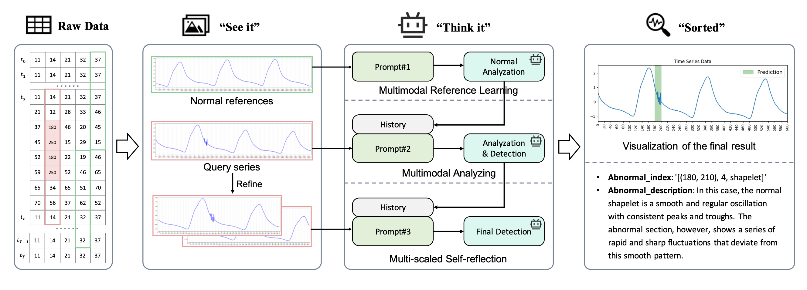

# TAMA: Time Series Anomaly Multimodal Analyzer

> **Paper:** *See it, Think it, Sorted: Large Multimodal Models are Few-shot Time Series Anomaly Analyzers*  
> Zhuang et al., arXiv:2411.02465

### Pipeline Overview
| Step | Stage | Description |
|------|-------|-------------|
| 1 | Preprocessing | z-score normalize → sliding window segmentation with overlap ratio $r_o = L_s / L_w$ |
| 2 | Image Conversion | render each window as a line chart PNG; resolution is capped to respect LMM token limits |
| 3 | Multimodal Reference Learning | provide $n_r = 3$ normal-window images so the LMM learns what "normal" looks like; ablation shows $n_r = 0$ causes a significant performance drop |
| 4 | Multimodal Analyzing | LMM outputs: anomaly intervals $\mathcal{A}_k$, anomaly type (point / shapelet / seasonal / trend), confidence scores $\mathcal{C}_k$, and a natural-language explanation $\mathcal{T}_k$ |
| 5 | Multi-scaled Self-reflection | for windows where anomalies were flagged, feed the LMM a zoomed-in crop of the detected region and ask it to re-verify — catches false positives without re-processing clean windows |
| 6 | Post-processing | map window-local intervals to global indices; sum confidence scores at overlapping points; threshold at $c_0$ to produce final binary mask |

### Limitations

1. **Cost & latency** — every sliding window triggers a separate vision LLM call; a single time series can require hundreds of API calls and takes minutes to process. Completely impractical for real-time or high-throughput settings.

2. **"Few-shot" claim vs. reference learning reality** — the method *depends* on labeled normal examples (ablation: $n_r = 0$ causes a significant performance drop). Two unresolved problems:
   - With thousands of normal windows, which 3 do you pick? The paper offers no selection strategy.
   - If you need labeled normals anyway, a simple autoencoder trained on normal data achieves the same goal far more cheaply and in a more principled way.

3. **Window size sensitivity** — performance is strongly tied to window size (~3× the dominant period is optimal), but the period is often unknown or non-stationary in practice. A non-trivial hyperparameter that requires domain knowledge to tune.
    - **Structural weakness on seasonal anomalies** — the paper's own numbers show only 29% classification accuracy on seasonal anomalies. A single window image captures too few cycles for the LMM to detect subtle phase shifts or amplitude drift — a fundamental limitation of the visual framing approach.

4. **Uncalibrated confidence scores** — the pipeline directly asks the LMM "how confident are you?" and sums those outputs across overlapping windows as if they were calibrated probabilities. LLMs are known to be poorly calibrated on numerical self-assessments; this aggregation has no statistical grounding.

---

the paper does not provide a script; the colab below follows its methodology

- https://colab.research.google.com/drive/1uuO3mCvy9pCm-r1AnaglfjeATtqQpqEe

no code was released; the prompt templates are central to performance but not fully specified. Minor rewording can shift LMM outputs significantly, making results hard to reproduce or trust across deployments.